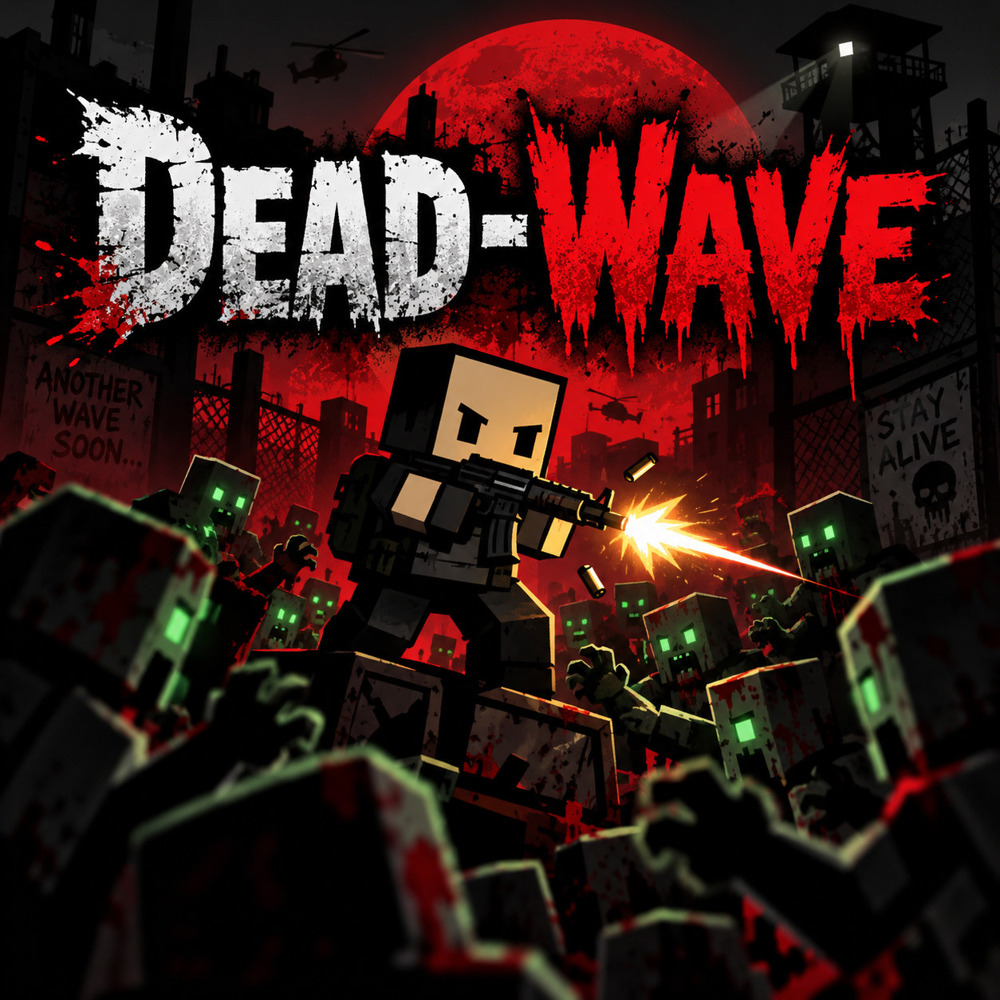

<p align="center">
  
</p>

# Dead-Wave

A top-down zombie survival game that runs in your browser. Hold a log cabin against wave after
wave of the dead, spend what you scavenge at the kiosk, and build your defences between waves.

Everything is in one page: `index.html`. The world, the characters and their animation are built
procedurally at load, there is no build step, and the only thing fetched from the network is
[Three.js](https://threejs.org).

## Play

**Windows:** double-click `Play Dead-Wave.bat`. It serves the folder on port 8766 and opens the
game in its own Edge window, asking for the high-performance GPU (see
[Graphics and rendering](docs/graphics-and-rendering.md) for why that matters on laptops).

**Anywhere else:** serve the folder over HTTP and open the page.

```bash
python3 -m http.server 8766
# then open http://localhost:8766/index.html
```

You need a current Chromium-based browser, and a network connection the first time to load Three.js
(`three@0.175`) from a CDN. WebGPU is used when available; otherwise the same renderer falls back to
WebGL2 by itself.

## How it plays

- **Waves and days.** Two minutes of prep between waves, then the horde. Every fourth day is a
  Blood Moon: red sky, a faster horde, x1.5 cash.
- **The kiosk.** Start with a pistol, a knife and $40. Weapons, ammo, armor, gear, upgrades, perks
  and build blueprints are all bought at the supply hatch in your cabin's east wall.
- **A big, varied horde.** Shamblers in the hundreds, plus Leapers, the Drowned, Spiders, Spitters,
  Screamers, Bombers, Brutes and the Colossus.
- **Build.** Barricades, walls, sandbags, spikes, fuel drums, mines, decoy beacons, lights, a manned
  mortar and more.
- **Hands-on combat.** Two-handed weapon holds, a dodge roll, headshots, knockdowns, a real
  first-person sniper scope and a fuel-blob flamethrower. Kill streaks pay extra cash and grant
  powers while they hold — faster feet, quick reloads, free rounds, thick skin.
- **Sound.** A mood-driven soundtrack of 15 generated tracks that changes with the fight, plus
  ambience that follows where you are (wind, river, birds, crickets, thunder).

### Controls at a glance

| Key | Action |
| --- | --- |
| `WASD` / arrows | Move (screen-relative). `Shift` run, `Space` jump |
| Mouse | Aim anywhere, 360 degrees. `LMB` fire, `RMB` zoom or scope |
| `V` / `C` | Dodge roll / crouch |
| Hold `Q` / `B` | Weapon wheel / build wheel — time slows, point, release |
| `E` | Action key: kiosk, mortar, and whatever the on-screen prompt says |
| `R` `G` `F` `Y` | Reload / grenade / knife / switch one gun or two |
| `H` | Use a medkit |
| `Tab` | Full map (the minimap shows the 50 m around you, turned with the camera) |
| `Enter` | Skip the prep countdown |
| `Esc` | Pause and Settings (volume, look, graphics, camera, fullscreen) |
| Wheel | Zoom the camera, 6 m to 24 m |

The full list, including the scope, build menu and gear keys, is in [docs/controls.md](docs/controls.md).

## Documentation

| | |
| --- | --- |
| [Controls](docs/controls.md) | Every key and mouse action, camera and settings |
| [Gameplay systems](docs/gameplay.md) | Kiosk, enemies, armor, weapons, builds, cash, Blood Moon |
| [Graphics and rendering](docs/graphics-and-rendering.md) | Quality presets, GPU notes, renderer internals, URL switches |
| [Soundtrack](docs/soundtrack.md) | The 15 tracks and how they are generated |
| [Performance report](docs/performance-report.txt) | Notes from an earlier stability and performance pass |

## Repository layout

```
index.html               the whole game
Play Dead-Wave.bat       Windows launcher (local server + Edge on the fast GPU)
assets/
  soundtrack/            the 15 tracks the game plays
tools/
  compose.py, synth.py   offline generator for the soundtrack (numpy, scipy)
docs/                    reference documentation, plus images/ (key art)
.claude/launch.json      dev-server config for Claude Code's preview pane
```

## Credits

- Built with [Three.js](https://threejs.org) (WebGPURenderer and TSL).
- Every character is built and animated procedurally in `index.html`; there are no model files.
- The soundtrack is composed and rendered by the scripts in `tools/`.
