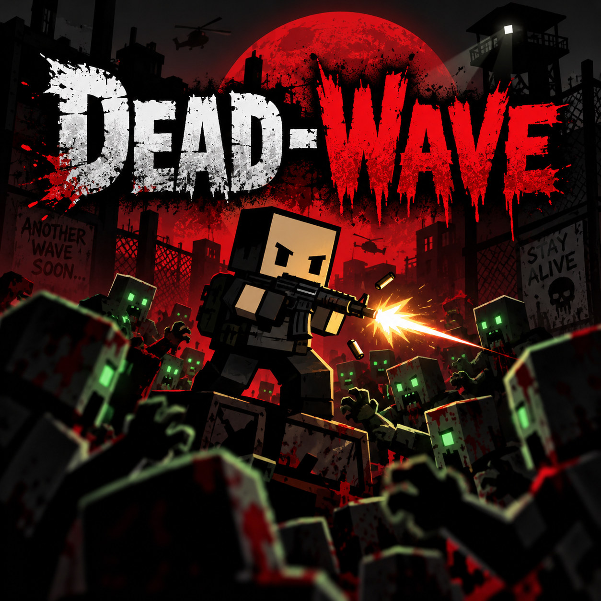

<p align="center">
  
</p>

# Dead-Wave

A third-person zombie survival game. You are one Gravewalker of the PGB (the Paranormal Ground Branch), dropped into a
forest valley ringed by mountains where FOB Threshold went dark three weeks ago. Hold the base through twenty nights of
the dead, find out what happened to the twelve who were sent before you, and get out on the floatplane on night 20.

Everything runs from one page, `index.html`, plus its modules (`core/`, `game/`, `ui/`, `world/`, `studio/`). The world,
the characters and their animation are built at load; there is no build step and nothing is fetched from the network
([Three.js](https://threejs.org) is in `vendor/`). The story is [docs/story.md](docs/story.md).

## Play

**Windows, the browser build:** double-click `Play Dead-Wave.bat`. It serves the folder on port 8766 and opens the game
in its own Edge window, asking for the high-performance GPU (see
[Graphics and rendering](docs/graphics-and-rendering.md) for why that matters on laptops).

**Windows, the desktop app:** `desktop/` builds an `.exe` and an installer round the same game (Tauri). How to build it,
where the save file lives and the rest: [desktop/README.md](desktop/README.md).

**Anywhere else:** serve the folder over HTTP and open the page, in a current Chromium-based browser.

```bash
python3 -m http.server 8766
# then open http://localhost:8766/index.html
```

WebGPU is used when available; otherwise the same renderer falls back to WebGL2 by itself.

## How it plays

- **Days and nights.** By day you scavenge, shop and build; the night starts when you sound the alarm at the HQ panel.
  Every fourth night is a Blood Moon, every fifth brings a colossus, and some nights have a name of their own (fog, the
  siege, the guardian). On night 20 Heron, the floatplane, comes to the lake: get aboard.
- **The base.** FOB Threshold's HQ: the supply terminal (guns arrive night by night, ammo, gear, upgrades, perks and
  build plans), the Armory (the four guns you carry, their mods and finishes), the skull window, and the roof, where the
  survivors you rescue stand with you: Okafor patches you up, Brandt mans the M240B, Pike makes repairs cheaper.
- **The valley.** Camps, the mine, the watchtower, the relay on the mast, the wreck and the cemetery, each with its notes
  from the twelve. Ridgeline talks once the relay is up.
- **The Hollows.** By day the caves can be entered: five warrens to clear, a haul to bring up, nine dog tags, and a
  secret under the chalk.
- **The horde.** Shamblers in their hundreds, each at its own pace, coming from every side, plus ferals, leapers, the
  drowned, spiders, spitters, screamers, bombers, brutes, the colossus and the guardian.
- **Build.** Walls, barricades, sandbags, wire, spikes, drums, mines, lights, turrets, a mortar, on a 2 m grid.
- **The Training Ground.** From the title: every gun, targets, and the dead on call, with nothing at stake.

### Controls at a glance

| Key | Action |
| --- | --- |
| `WASD` / arrows | Move (screen-relative). `Shift` run, `Space` jump, `V` dodge roll, hold `C` crouch |
| Mouse | Aim anywhere. `LMB` fire, `RMB` zoom (a real scope on the sniper rifle) |
| Hold `Q` / `B` | Weapon wheel / build wheel: time slows, point, release |
| `E` | Whatever the on-screen prompt says: the terminal, the Armory, the alarm, a mortar, a cave |
| `R` `G` `F` | Reload / grenade / blade |
| `H` | Use a MedPen |
| `X` | Fire selector (AUTO / SEMI); in build mode, sell |
| `Y` | One gun or two (pistol, Uzi, revolver) |
| `1` `2` `3` `4` | Night vision, flashlight, laser, holster |
| `T` | Repair |
| `Tab` | Full map |
| `Esc` | Pause and Settings |
| `~` | Dev console (`night 5` jumps to night 5; the full list is in [docs/controls.md](docs/controls.md)) |

Every key, the camera and the settings: [docs/controls.md](docs/controls.md).

## Documentation

| | |
| --- | --- |
| [Story](docs/story.md) | The valley, the PGB, the twelve, the survivors, the secret |
| [Controls](docs/controls.md) | Every key and mouse action, camera and settings |
| [Gameplay systems](docs/gameplay.md) | Weapons, calibres, enemies, armor, builds (written before story v2: see its note) |
| [Loadout](docs/loadout.md) and [wardrobe](docs/wardrobe.md) | What he carries and wears |
| [Graphics and rendering](docs/graphics-and-rendering.md) | Quality presets, GPU notes, renderer internals, URL switches |
| [Soundtrack](docs/soundtrack.md) | The tracks and how they are generated |
| [Studio guide](docs/studio-guide.md) | The animation studio in plain words: review folders, notes, scenes |
| [Contracts](docs/contracts.md) | What each part of the game promises the others |
| [Roadmap](docs/roadmap.md) and [decisions](docs/decisions.md) | Where the game is going, and every call made on the way |

## Repository layout

```
index.html               the game
Play Dead-Wave.bat       Windows launcher (local server + Edge on the fast GPU)
desktop/                 the desktop app (Tauri): the .exe and the installer
package.json             npm test / npm run serve
core/ game/ ui/ world/   modules split out of index.html
studio/                  the animation studio: rigs, clips, scenes and their player
review/                  what the studio renders for Jerry to look at (one folder per asset)
assets/                  soundtrack, intro, animation and world data
vendor/                  three.js and fonts, byte-exact
tools/                   test runner and tests (tools/tests), packaging, dev server, renderers, generators
qa/                      Antigravity's GPU checks: reports, run scripts, screenshots
crew/                    the crew's board, log, status cards and panel (Open Crew Panel.bat)
handoffs/                every agent's report, one file per task
docs/                    reference documentation; docs/archive holds old one-off notes
```

Local only (not in git): `Claude outputs/` (Claude's commit box and old previews) and
`Claude Commit.bat` (commits and pushes a job Claude leaves in that box).

## Credits

- Built with [Three.js](https://threejs.org) (WebGPURenderer and TSL).
- The characters are built in code; the walk and the run are retargeted from the Universal Animation Library (CC0).
- The soundtrack is composed and rendered by the scripts in `tools/`.
